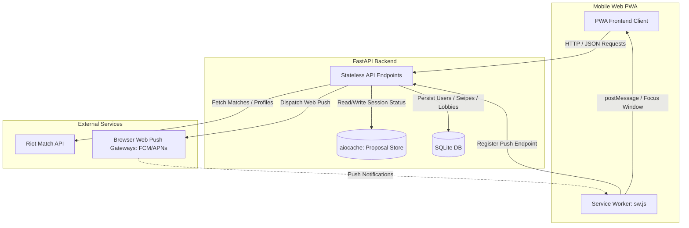
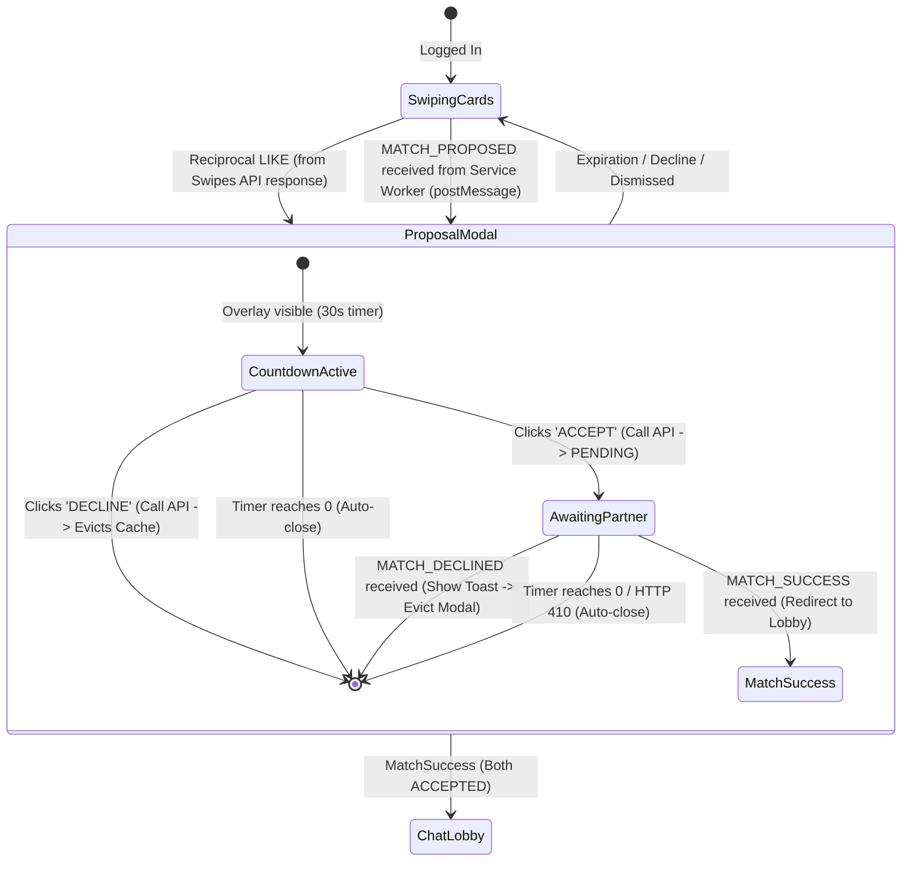

# Linder: Mobile Web Client & API Specification

Linder is a high-performance, real-time matchmaking Progressive Web App (PWA) for *League of Legends* players. It allows players who were in the same recent match to discover each other, swipe to show interest, and establish a real-time chat connection under a strict **30-second match acceptance window**.

This specification is designed for the frontend Software Engineer implementing the mobile web client. It outlines the API contracts, Progressive Web App (PWA) requirements, W3C Web Push flow, UI/UX state machines, and local development testing mechanisms.

---

## 1. System Architecture & High-Level Flow

Linder operates as a stateless backend optimized for high concurrency (targeting 10,000+ active users) backed by a SQLite database with WAL mode and serialized writes, and a fast in-memory proposal cache. Real-time notifications are delivered over the standard W3C Web Push Protocol.



---

## 2. PWA, Framework, & Hosting Requirements

To deliver a high-quality, app-like experience on iOS Safari and Android Chrome, the client is implemented as a **React** Progressive Web App. It must be structured to allow trivial static hosting on services like GitHub Pages.

1. **Framework Choice**: React (built using Vite + TypeScript is recommended).
2. **Client-Side Routing**: Must use **Hash Routing** (e.g., `HashRouter` from `react-router-dom`).
   - URLs will form as `https://<host>/<repo-name>/#/lobby/<lobby_id>`.
   - *Rationale*: GitHub Pages does not support native SPA fallback redirects. Using hash routing bypasses server-side path checking, preventing 404 errors on browser refresh.
3. **Subfolder Paths / Base URL**:
   - Assets and service worker registration must be relative to the repository path (e.g., `base: "/linder/"` in `vite.config.js`).
4. **Manifest File (`manifest.json`)**:
   - `display: "standalone"` must be set to hide the browser address bar.
   - `orientation: "portrait"` to enforce vertical layout.
   - App icons: High-quality icons (192x192 and 512x512) to permit "Add to Home Screen".
5. **Service Worker Registration**:
   - Registers the service worker located at [public/sw.js](file:///d:/Coding/Linder/public/sw.js) on application mount.
   - Resolves registration status to enable push subscription requests. Must specify `{ scope: './' }` to bind to the subfolder correctly.
6. **Aesthetic Standards**:
   - **Vibrant Dark-Mode Theme**: HSL-based dark mode featuring deep space/lol theme colors (e.g., gold accents, deep blues/purples, and dark grays) resembling the League of Legends client interface.
   - **No Default Controls**: Custom styled inputs, smooth transitions, and glassmorphic overlays for modal states.
   - **Haptic Feedback**: Standard mobile haptic micro-interactions on button clicks, swipes, and timers where supported.

---

## 3. Authentication & Authorization

All endpoints (except the authentication token endpoint) require a JSON Web Token (JWT) in the HTTP header:

```http
Authorization: Bearer <jwt_token>
```

### Development & Simulation Bypass Token
To simplify testing, automated front-end testing, and load-test generation, the backend implements a bypass route:
* Any authorization token prefixed with `mock_token_user_` bypasses standard cryptographic signature validation.
* The system parses this token to extract the string that follows the prefix and assumes that identity directly.
* **Example**: An Authorization header of `Bearer mock_token_user_usr_1` authenticates the client instantly as user `usr_1`.

---

## 4. API Endpoint Specifications

The backend source routes are defined in the following files:
* Authentication: [app/routes/auth.py](file:///d:/Coding/Linder/app/routes/auth.py)
* Candidates: [app/routes/candidates.py](file:///d:/Coding/Linder/app/routes/candidates.py)
* Notification Subscriptions: [app/routes/notifications.py](file:///d:/Coding/Linder/app/routes/notifications.py)
* Swipe Registry: [app/routes/swipes.py](file:///d:/Coding/Linder/app/routes/swipes.py)
* Match Proposal Responses: [app/routes/match.py](file:///d:/Coding/Linder/app/routes/match.py)

---

### 4.1. Get JWT Token / Registration
* **Route**: `POST /api/v1/auth/token`
* **Authentication Required**: No
* **Request Payload (`application/json`)**:
  ```json
  {
    "puuid": "puuid_faker",
    "riot_id_name": "Faker",
    "riot_id_tag": "KR1"
  }
  ```
* **Response (200 OK)**:
  ```json
  {
    "access_token": "eyJhbGciOiJIUzI1NiIsInR5cCI6IkpXVCJ9...",
    "token_type": "bearer",
    "user_id": "usr_faker"
  }
  ```
  *(Note: If the PUUID is new, the server automatically registers the user record. If the PUUID exists, it updates the registered Riot ID name and tag.)*

---

### 4.2. Subscribe to Web Push
* **Route**: `POST /api/v1/notifications/subscribe`
* **Authentication Required**: Yes (`Bearer <token>`)
* **Request Payload (`application/json`)**:
  ```json
  {
    "endpoint": "https://updates.push.services.mozilla.com/wpush/v2/gAAAAAB...",
    "keys": {
      "p256dh": "BDo_7C9m32O3K7f...",
      "auth": "5Az8Z8g..."
    }
  }
  ```
* **Response (201 Created)**:
  ```json
  {
    "message": "Subscription saved"
  }
  ```
* **Response Errors**:
  - `400 Bad Request` if payload structure is invalid.
  - `401 Unauthorized` if bearer token is missing or invalid.

---

### 4.3. Retrieve Swipe Candidates
* **Route**: `GET /api/v1/candidates`
* **Authentication Required**: Yes (`Bearer <token>`)
* **Behavior**: Fetches the authenticated user's latest completed match, filters for participants who have registered Linder accounts, and excludes any candidate whom the current user has already swiped on.
* **Response (200 OK)**:
  ```json
  {
    "match_id": "NA1_5982385567",
    "candidates": [
      {
        "user_id": "usr_caps",
        "riot_id": "Caps#EUW1",
        "champion_name": "LeBlanc",
        "kills": 4,
        "deaths": 6,
        "assists": 5,
        "win": false,
        "cs": 190
      }
    ]
  }
  ```
  *(Note: CS is calculated as `totalMinionsKilled + neutralMinionsKilled` from the Riot API).*

---

### 4.4. Register Swipe Action
* **Route**: `POST /api/v1/swipes`
* **Authentication Required**: Yes (`Bearer <token>`)
* **Request Payload (`application/json`)**:
  ```json
  {
    "target_user_id": "usr_caps",
    "action": "LIKE"
  }
  ```
  *(Supported actions: `"LIKE"`, `"PASS"`)*
* **Response (200 OK - No Match)**:
  ```json
  {
    "matched": false,
    "proposal_id": null,
    "expires_in_seconds": null
  }
  ```
* **Response (200 OK - Match Proposal Created)**:
  ```json
  {
    "matched": true,
    "proposal_id": "8bfa2d5e-ca59-411a-8cfa-5d0eb1b4b0e8",
    "expires_in_seconds": 30
  }
  ```
  *(When a match is created, the backend initiates a cached proposal with a 30-second TTL and fires a push notification to the target user in the background.)*
* **Response Errors**:
  - `400 Bad Request` if action is invalid or if target is the user themselves.

---

### 4.5. Respond to Match Proposal
* **Route**: `POST /api/v1/match/respond`
* **Authentication Required**: Yes (`Bearer <token>`)
* **Request Payload (`application/json`)**:
  ```json
  {
    "proposal_id": "8bfa2d5e-ca59-411a-8cfa-5d0eb1b4b0e8",
    "action": "ACCEPT"
  }
  ```
  *(Supported actions: `"ACCEPT"`, `"DECLINE"`)*
* **Response (200 OK - Waiting for Partner)**:
  ```json
  {
    "status": "PENDING",
    "lobby_id": null
  }
  ```
* **Response (200 OK - Mutual Acceptance Success)**:
  ```json
  {
    "status": "SUCCESS",
    "lobby_id": "lob_abc123"
  }
  ```
* **Response (200 OK - Proposal Declined)**:
  ```json
  {
    "status": "DECLINED",
    "lobby_id": null
  }
  ```
* **Response (410 Gone - Expired or Declined)**:
  ```json
  {
    "detail": "Proposal expired or declined"
  }
  ```
  *(This code occurs if the 30-second TTL expires, or if the partner has already sent a `DECLINE` request which deleted the cached proposal.)*

---

## 5. Web Push Notification Architecture

Web Push notifications are critical for driving the real-time, interactive flow when a user is backgrounded or in an active browser tab. The service worker is located at [public/sw.js](file:///d:/Coding/Linder/public/sw.js).

### 5.1. Push Notification Payloads
The server dispatches three distinct push payload structures depending on the state transitions.

#### 1. `MATCH_PROPOSED`
Sent to the target user when a reciprocal `LIKE` is received.
```json
{
  "type": "MATCH_PROPOSED",
  "proposal_id": "8bfa2d5e-ca59-411a-8cfa-5d0eb1b4b0e8",
  "expires_in": 30
}
```

#### 2. `MATCH_SUCCESS`
Sent to the first user who accepted the match when the second user subsequently accepts.
```json
{
  "type": "MATCH_SUCCESS",
  "lobby_id": "lob_abc123"
}
```

#### 3. `MATCH_DECLINED`
Sent to both users if either party declines the match.
```json
{
  "type": "MATCH_DECLINED",
  "proposal_id": "8bfa2d5e-ca59-411a-8cfa-5d0eb1b4b0e8"
}
```

---

### 5.2. Service Worker Message & Navigation Interceptor (`sw.js`)

The service worker acts as a router. It checks whether the application's browser window is currently open and visible:

1. **If Application is Open & Active (Foreground)**:
   - The service worker **suppresses** the browser's native OS notification bubble.
   - It forwards a message to the active client window using `postMessage()`:
     ```javascript
     client.postMessage({
       type: "MATCH_PROPOSED",
       proposal_id: data.proposal_id,
       expires_in: data.expires_in
     });
     ```
   - The client application intercepts this message via `navigator.serviceWorker.onmessage` to trigger the overlay modal lock.

2. **If Application is Closed or Backgrounded**:
   - The service worker displays a native OS notification:
     - **Title**: `"Linder: Match Found!"`
     - **Body**: `"A player from your last match wants to connect. You have 30 seconds to join!"`
     - **Data**: Saves the `proposal_id` in the notification context.
   - **Click Action (`notificationclick`)**:
     - Closes the notification overlay.
     - Searches for an open tab matching the site. If found, it focuses the tab and posts a message to navigate:
       ```javascript
       client.postMessage({ type: "NAVIGATE", url: "/match/accept?id=PROPOSAL_ID" });
       ```
     - If no tab is open, it launches a new browser window directed to the acceptance route:
       ```javascript
       self.clients.openWindow("/match/accept?id=PROPOSAL_ID");
       ```

---

## 6. Client UI/UX State Machine & User Flow

The client must implement a strict UI overlay state machine to handle the 30-second match proposal lock. The user should not be able to bypass the modal to view candidates once a proposal is active.



### 6.1. The "30-Second Match Lock" Modal Requirements
* **Enforced Overlay**: The modal must block all swipe-card interactions. It should display a circular progress bar reflecting the countdown timer (starting at 30 seconds, decreasing by 1 every second).
* **Sound & Vibration**: Play a subtle chime sound and trigger device vibration when the modal is initiated, calling attention to the time-sensitive event.
* **ACCEPT Action Flow**:
  1. User clicks `"ACCEPT"`. Disable the buttons and display a spinner with the text `"Waiting for teammate..."`.
  2. Send a `POST` request to `/api/v1/match/respond` with `"action": "ACCEPT"`.
  3. If response status is `"PENDING"`, keep the spinner active.
  4. If response status is `"SUCCESS"`, extract the `lobby_id` and transition the view to the Chat Lobby immediately.
  5. If response returns a `410 Gone`, close the modal instantly and show a toast: `"Match expired!"`.
* **DECLINE Action Flow**:
  1. User clicks `"DECLINE"`.
  2. Send a `POST` request to `/api/v1/match/respond` with `"action": "DECLINE"`.
  3. Close the modal and restore card-swiping view.
* **Auto-Eviction via Service Worker postMessage**:
  - The page must listen for events via `navigator.serviceWorker.onmessage`.
  - If a message of type `"MATCH_DECLINED"` is received, immediately close the modal and display a toast: `"Partner declined connection"`.
  - If a message of type `"MATCH_SUCCESS"` is received (containing `lobby_id`), transition to the Chat Lobby immediately.

### 6.2. Chat Lobby Requirements
* Once a match transitions into `"SUCCESS"`, the user enters a lobby view associated with the `lobby_id`.
* The client should present a clean, real-time-capable chat window.
* *(Note: In the current backend prototype, the database maintains the `messages` table schema, but real-time message broadcasting endpoints will be defined in a subsequent version. The client should build the UI view framework for the chat log, including the list of participants, sender bubbles, and an input text area).*

---

## 7. Local Development & Testing Guide

To verify end-to-end swiping, web push notifications, and modal triggers locally without configuring Riot API keys or live push gateways, developers can take advantage of the mock client subsystems built into Linder.

### 7.1. Triggering a Local Match Pairing
The [app/services/riot.py](file:///d:/Coding/Linder/app/services/riot.py) file contains a `MockRiotClient` designed to pair virtual users deterministically based on whether their user IDs are odd or even.

Follow these steps to test the swipe-to-match flow with two browser tabs:

1. **Start the server**:
   - Run standard local environment setup: `uvicorn main:app --reload --workers 1`
2. **Configure Tab 1 (User 1)**:
   - Send `POST /api/v1/auth/token` with:
     ```json
     {
       "puuid": "puuid_user_1",
       "riot_id_name": "User_1",
       "riot_id_tag": "NA1"
     }
     ```
   - Store the returned token (`access_token`) and user ID (`usr_1`).
   - Query `GET /api/v1/candidates` using User 1's token. The mock client will return a candidate array containing **User 2** (`usr_2` / `User_2#NA1`) because `1` (odd) is paired with `2` (even).
3. **Configure Tab 2 (User 2)**:
   - Send `POST /api/v1/auth/token` with:
     ```json
     {
       "puuid": "puuid_user_2",
       "riot_id_name": "User_2",
       "riot_id_tag": "NA1"
     }
     ```
   - Store the returned token and user ID (`usr_2`).
   - Query `GET /api/v1/candidates` using User 2's token. The response will return a candidate array containing **User 1** (`usr_1` / `User_1#NA1`).
4. **Initiate Swipes**:
   - **Tab 1** sends `POST /api/v1/swipes` swiping `LIKE` on `usr_2`. Response will be `matched: false`.
   - **Tab 2** sends `POST /api/v1/swipes` swiping `LIKE` on `usr_1`. Response will be `matched: true`, containing a `proposal_id` and `expires_in_seconds: 30`.
5. **Verify Modal Lock**:
   - Tab 1 receives a web push notification payload `MATCH_PROPOSED` or captures it via the Service Worker.
   - Both tabs display the countdown overlay.
   - Accept the match on both tabs using the `/api/v1/match/respond` endpoint to test lobby creation.
